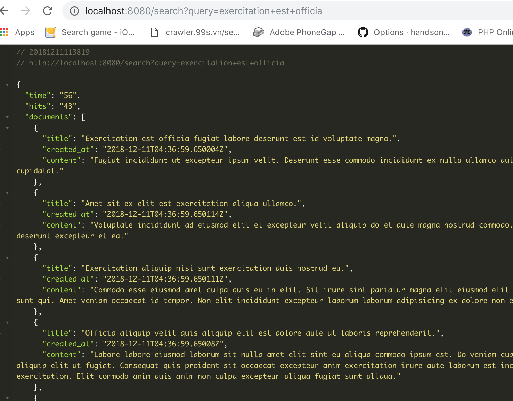

## Installation

```bash
# install requirement
yarn
# start env
$ yarn start-env
# run in hot-reload
$ yarn start
```

on macOS The vm.max_map_count setting must be set within the xhyve virtual machine:

`screen ~/Library/Containers/com.docker.docker/Data/vms/0/tty`
_control + a, d_ to leave detached screen, _control + a, k_ to kill this screen
Just press enter and configure the sysctl setting as you would for Linux:

`sysctl -w vm.max_map_count=262144`

to seed data:  
`curl -X POST http://localhost:8080/documents -d @fake-data.json -H "Content-Type: application/json"`

to search data:  
`curl http://localhost:8080/search?query=exercitation+est+officia | jq '.'`


